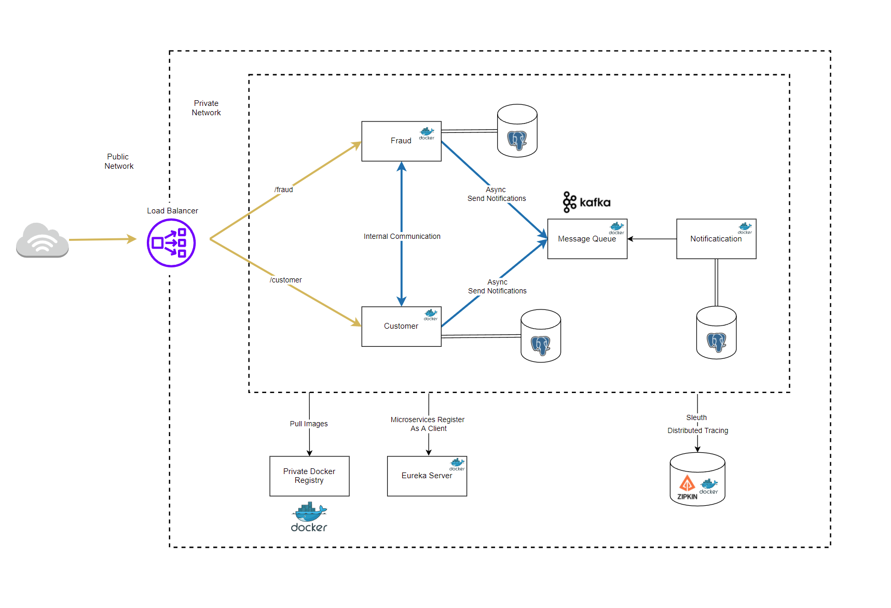

# Microservice architecture example in Spring Boot

This project is an example of microservice architecture
in Spring Boot using Maven.  


## Architecture



Request that is going through all components in this architecture 
is customer creation. 🕺

### Flow example:

1. Client send a POST request to localhost:8083/api/v1/customer
with a sample body:
```json
{
    "firstName": "Andrew",
    "lastName": "Huang",
    "email": "andrew@gmail.com"
}
```
2. Request is sent to **Api Gateway** from where it is 
redirected to correct microservice -> **Customer**.

3. **Customer** microservice saves customer and checks if is fraudster by sending proper request to **Fraud** microservice.

4. After **Fraud** microservice response, the notification about customer creation is sent to **Kafka**.

5. The **Notification** microservice gets the notification from **Kafka** and saves it to the DB


## How to run

### What you need to have installed
* Java 17 ❤️
* Maven
* Docker

### Run locally

For simplicity, we will use docker to run: **postgres**, **pgadmin**, **zookeeper**, **kafka**, **zipkin**.

```bash
docker-compose up postgres pgadmin zookeeper kafka zipkin -d
```

⚠️ Warrning!

Before running docker, change in docker-compose.yaml file line 83 to:
```dockerfile
KAFKA_ADVERTISED_LISTENERS: PLAINTEXT://localhost:9092,PLAINTEXT_INTERNAL://kafka:29092
```

Now, we can run the rest of the microservices locally:
* eureka-server
* apigw
* customer
* fraud
* notification

You can run them through the IDE or using command 
``mvn spring-boot:run`` inside every microservice folder.


### Run fully dockerized

To run everything in docker just type:
```bash
docker-compose up -d 
```


## Deployment

To deploy changes made in microservices, go to the root folder
of the project and run:

```
mvn clean package -P build-docker-image
```

⚠️ Deploy docker images on your own account! (example: your_username/customer)

⚠️ You must be logged in to push docker images. Use `docker login`.

